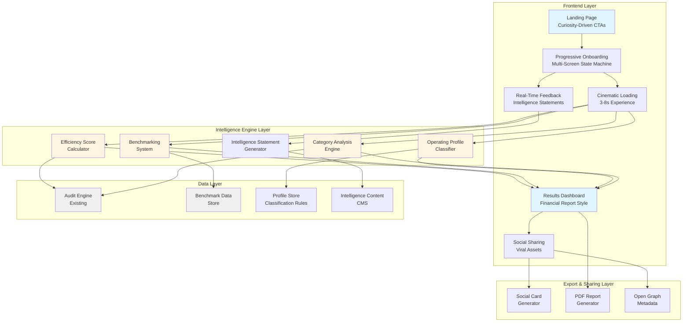
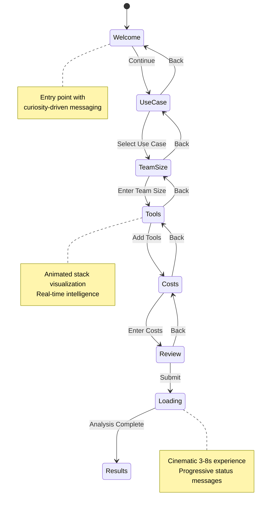

# Design Document: AI Infrastructure Intelligence Platform Transformation

## Overview

This document specifies the technical design for transforming SpendLens from a functional cost calculator into an elite AI Infrastructure Intelligence Platform. The transformation shifts the product from arithmetic-focused cost savings to a comprehensive intelligence engine that creates emotional impact, builds founder identity, and becomes unforgettable.

### Design Philosophy

The core architectural shift moves from:
- **Synchronous single-form submission → Progressive multi-screen discovery journey**
- **Static results display → Dynamic intelligence engine with real-time feedback**
- **Simple cost calculation → Multi-dimensional efficiency scoring with benchmarking**
- **Generic output → Personalized operating profiles with identity**
- **Basic sharing → Viral-optimized social assets with cinematic presentation**

### Key Design Principles

1. **Progressive Disclosure**: Information is revealed screen-by-screen to maintain engagement
2. **Real-Time Intelligence**: Live feedback creates perception of active analysis
3. **Emotional Architecture**: Design creates anticipation, realization, and pride moments
4. **Data Integrity**: All transformations are reversible and testable via round-trip properties
5. **Performance First**: Sub-100ms updates, 60fps animations, GPU acceleration
6. **Accessibility Compliance**: WCAG 2.1 AA standards throughout

## Architecture

### System Architecture Diagram



### Component Hierarchy


```
src/
├── app/
│   ├── discover/                    # NEW: Progressive onboarding flow
│   │   ├── page.tsx                # Entry point with state machine
│   │   └── layout.tsx              # Shared layout for discovery
│   ├── loading/                     # NEW: Cinematic loading experience
│   │   └── [sessionId]/
│   │       └── page.tsx
│   ├── intelligence/                # NEW: Results dashboard (replaces /results)
│   │   └── [id]/
│   │       ├── page.tsx            # Financial report-style dashboard
│   │       └── export/
│   │           └── route.ts        # PDF export endpoint
│   ├── share/
│   │   └── [id]/
│   │       └── page.tsx            # Enhanced with social cards
│   └── api/
│       ├── audit/
│       │   └── route.ts            # Enhanced with efficiency scoring
│       ├── intelligence/            # NEW: Intelligence endpoints
│       │   ├── score/
│       │   │   └── route.ts        # Efficiency score calculation
│       │   ├── benchmark/
│       │   │   └── route.ts        # Benchmark comparisons
│       │   └── profile/
│       │       └── route.ts        # Operating profile classification
│       ├── social-card/             # NEW: Social card generation
│       │   └── [id]/
│       │       └── route.ts
│       └── export/                  # NEW: Report export
│           └── [id]/
│               └── route.ts
│
├── components/
│   ├── discover/                    # NEW: Progressive onboarding components
│   │   ├── discovery-flow.tsx      # State machine orchestrator
│   │   ├── screen-welcome.tsx      # Screen 1: Welcome
│   │   ├── screen-use-case.tsx     # Screen 2: Use case selection
│   │   ├── screen-team-size.tsx    # Screen 3: Team size
│   │   ├── screen-tools.tsx        # Screen 4: Tool selection
│   │   ├── screen-costs.tsx        # Screen 5: Cost input
│   │   ├── screen-review.tsx       # Screen 6: Review & submit
│   │   ├── progress-indicator.tsx  # Visual progress bar
│   │   ├── intelligence-card.tsx   # Contextual insights
│   │   └── stack-visualizer.tsx    # Animated tool cards
│   ├── intelligence/                # NEW: Results dashboard components
│   │   ├── efficiency-hero.tsx     # Hero with efficiency score
│   │   ├── efficiency-breakdown.tsx # Score component breakdown
│   │   ├── benchmark-section.tsx   # Comparative benchmarks
│   │   ├── profile-badge.tsx       # Operating profile display
│   │   ├── category-chart.tsx      # Spend by category
│   │   ├── strategic-insights.tsx  # Executive-level insights
│   │   ├── tool-analysis.tsx       # Tool-by-tool breakdown
│   │   └── export-actions.tsx      # PDF/share buttons
│   ├── loading/                     # NEW: Cinematic loading
│   │   ├── loading-sequence.tsx    # Orchestrates loading states
│   │   ├── status-message.tsx      # Animated status messages
│   │   └── progress-bar.tsx        # Smooth progress indicator
│   ├── social/                      # NEW: Social sharing
│   │   ├── share-modal.tsx         # Share dialog
│   │   ├── social-card-preview.tsx # Preview before sharing
│   │   └── share-buttons.tsx       # Platform-specific buttons
│   └── ui/                          # Enhanced base components
│       ├── animated-card.tsx       # NEW: Spring-animated card
│       ├── metric-display.tsx      # NEW: Premium metric component
│       ├── chart.tsx               # NEW: Recharts wrapper
│       └── badge.tsx               # Enhanced with animations
│
├── lib/
│   ├── intelligence/                # NEW: Intelligence engine
│   │   ├── efficiency-score.ts     # Scoring algorithm
│   │   ├── benchmarking.ts         # Benchmark calculations
│   │   ├── profile-classifier.ts   # Operating profile logic
│   │   ├── category-analyzer.ts    # Category breakdown
│   │   ├── insights-generator.ts   # Strategic insights
│   │   └── types.ts                # Intelligence types
│   ├── discovery/                   # NEW: Discovery flow state
│   │   ├── state-machine.ts        # Flow orchestration
│   │   ├── validation.ts           # Screen-by-screen validation
│   │   └── persistence.ts          # Browser storage
│   ├── content/                     # NEW: Intelligence statements
│   │   ├── statements.ts           # Content database
│   │   ├── triggers.ts             # Contextual triggers
│   │   └── templates.ts            # Variable interpolation
│   ├── benchmarks/                  # NEW: Benchmark data
│   │   ├── data.ts                 # Benchmark database
│   │   ├── segments.ts             # Segmentation logic
│   │   └── comparisons.ts          # Comparison generators
│   ├── export/                      # NEW: Export functionality
│   │   ├── pdf-generator.ts        # PDF creation
│   │   ├── social-card.ts          # Social card rendering
│   │   └── templates.ts            # Export templates
│   ├── parsers/                     # NEW: Data transformation
│   │   ├── efficiency-score.ts     # Score parser/formatter
│   │   ├── benchmark.ts            # Benchmark parser/formatter
│   │   └── profile.ts              # Profile parser/formatter
│   └── animations/                  # NEW: Animation utilities
│       ├── spring-configs.ts       # Framer Motion configs
│       ├── transitions.ts          # Transition definitions
│       └── utils.ts                # Animation helpers
│
└── data/
    ├── benchmarks.json              # NEW: Benchmark data
    ├── profiles.json                # NEW: Operating profiles
    └── intelligence-statements.json # NEW: Content database
```

## Components and Interfaces

### 1. Progressive Onboarding Flow

#### State Machine Design




#### Discovery Flow State Interface

```typescript
interface DiscoveryState {
  currentScreen: ScreenId;
  completedScreens: Set<ScreenId>;
  data: {
    useCase?: UseCase;
    teamSize?: number;
    tools: ToolSelection[];
    costs: Record<string, CostInput>;
  };
  intelligenceShown: string[]; // Track shown statements
  sessionId: string;
  startedAt: Date;
  lastUpdated: Date;
}

type ScreenId = 
  | 'welcome'
  | 'use-case'
  | 'team-size'
  | 'tools'
  | 'costs'
  | 'review';

interface ToolSelection {
  toolId: ToolId;
  planId?: string;
  addedAt: Date;
}

interface CostInput {
  monthlySpend: number;
  seats: number;
  validatedAt: Date;
}
```

#### Screen Transition Logic

```typescript
class DiscoveryFlowMachine {
  private state: DiscoveryState;
  
  constructor(initialState?: Partial<DiscoveryState>) {
    this.state = this.initializeState(initialState);
  }
  
  // Navigate to next screen
  next(): ScreenId | null {
    const current = this.state.currentScreen;
    const transitions: Record<ScreenId, ScreenId | null> = {
      'welcome': 'use-case',
      'use-case': 'team-size',
      'team-size': 'tools',
      'tools': 'costs',
      'costs': 'review',
      'review': null, // Triggers submission
    };
    
    const nextScreen = transitions[current];
    if (nextScreen) {
      this.state.completedScreens.add(current);
      this.state.currentScreen = nextScreen;
      this.persist();
    }
    return nextScreen;
  }
  
  // Navigate to previous screen
  back(): ScreenId | null {
    const current = this.state.currentScreen;
    const backTransitions: Record<ScreenId, ScreenId | null> = {
      'welcome': null,
      'use-case': 'welcome',
      'team-size': 'use-case',
      'tools': 'team-size',
      'costs': 'tools',
      'review': 'costs',
    };
    
    const prevScreen = backTransitions[current];
    if (prevScreen) {
      this.state.currentScreen = prevScreen;
      this.persist();
    }
    return prevScreen;
  }
  
  // Update data for current screen
  updateData(data: Partial<DiscoveryState['data']>): void {
    this.state.data = { ...this.state.data, ...data };
    this.state.lastUpdated = new Date();
    this.persist();
  }
  
  // Validate current screen can proceed
  canProceed(): boolean {
    const validators: Record<ScreenId, () => boolean> = {
      'welcome': () => true,
      'use-case': () => !!this.state.data.useCase,
      'team-size': () => !!this.state.data.teamSize && this.state.data.teamSize > 0,
      'tools': () => this.state.data.tools.length > 0,
      'costs': () => this.validateCosts(),
      'review': () => this.validateComplete(),
    };
    
    return validators[this.state.currentScreen]();
  }
  
  // Persist to browser storage
  private persist(): void {
    if (typeof window !== 'undefined') {
      sessionStorage.setItem(
        `discovery-${this.state.sessionId}`,
        JSON.stringify(this.state)
      );
    }
  }
  
  // Restore from browser storage
  static restore(sessionId: string): DiscoveryFlowMachine | null {
    if (typeof window === 'undefined') return null;
    
    const stored = sessionStorage.getItem(`discovery-${sessionId}`);
    if (!stored) return null;
    
    try {
      const state = JSON.parse(stored);
      return new DiscoveryFlowMachine(state);
    } catch {
      return null;
    }
  }
}
```

### 2. Intelligence Statement System

#### Content Structure

```typescript
interface IntelligenceStatement {
  id: string;
  content: string; // Template with {{variables}}
  trigger: StatementTrigger;
  priority: number; // Higher = shown first
  category: 'insight' | 'benchmark' | 'tip' | 'warning';
  factBased: boolean; // true = backed by data, false = illustrative
}

interface StatementTrigger {
  type: 'use-case' | 'tool-added' | 'spend-threshold' | 'team-size' | 'overlap';
  conditions: TriggerCondition[];
}

type TriggerCondition = 
  | { type: 'use-case'; value: UseCase }
  | { type: 'tool'; toolId: ToolId }
  | { type: 'spend-above'; amount: number }
  | { type: 'team-size-range'; min: number; max: number }
  | { type: 'has-overlap'; category: string };

// Example statements
const INTELLIGENCE_STATEMENTS: IntelligenceStatement[] = [
  {
    id: 'coding-cursor-insight',
    content: 'Teams focused on {{useCase}} typically spend {{benchmarkAmount}}/developer on IDE assistants. Your selection of {{toolName}} aligns with high-performing engineering teams.',
    trigger: {
      type: 'tool-added',
      conditions: [
        { type: 'use-case', value: 'coding' },
        { type: 'tool', toolId: 'cursor' }
      ]
    },
    priority: 8,
    category: 'insight',
    factBased: true
  },
  {
    id: 'high-spend-warning',
    content: 'Your spend per developer is already {{percentile}}% above startups your size. We\'ll identify optimization opportunities in your analysis.',
    trigger: {
      type: 'spend-threshold',
      conditions: [
        { type: 'spend-above', amount: 100 }
      ]
    },
    priority: 10,
    category: 'warning',
    factBased: true
  },
  {
    id: 'overlap-detected',
    content: '{{tool1}} and {{tool2}} have overlapping functionality. Most teams find one {{category}} assistant sufficient — we\'ll analyze if consolidation makes sense.',
    trigger: {
      type: 'overlap',
      conditions: [
        { type: 'has-overlap', category: 'ide-assistant' }
      ]
    },
    priority: 9,
    category: 'tip',
    factBased: true
  }
];
```

#### Statement Selection Algorithm

```typescript
class IntelligenceStatementEngine {
  private statements: IntelligenceStatement[];
  private shownStatements: Set<string>;
  
  constructor(statements: IntelligenceStatement[]) {
    this.statements = statements;
    this.shownStatements = new Set();
  }
  
  // Select statement based on context
  selectStatement(context: DiscoveryContext): IntelligenceStatement | null {
    // Filter statements that match current context
    const candidates = this.statements.filter(stmt => 
      this.matchesTrigger(stmt.trigger, context) &&
      !this.shownStatements.has(stmt.id)
    );
    
    if (candidates.length === 0) return null;
    
    // Sort by priority (higher first)
    candidates.sort((a, b) => b.priority - a.priority);
    
    // Select highest priority
    const selected = candidates[0];
    this.shownStatements.add(selected.id);
    
    return selected;
  }
  
  // Interpolate variables in statement
  interpolate(statement: IntelligenceStatement, context: DiscoveryContext): string {
    let content = statement.content;
    
    // Replace {{variables}} with actual values
    const variables = this.extractVariables(context);
    for (const [key, value] of Object.entries(variables)) {
      content = content.replace(new RegExp(`{{${key}}}`, 'g'), String(value));
    }
    
    return content;
  }
  
  private matchesTrigger(trigger: StatementTrigger, context: DiscoveryContext): boolean {
    return trigger.conditions.every(condition => {
      switch (condition.type) {
        case 'use-case':
          return context.useCase === condition.value;
        case 'tool':
          return context.tools.some(t => t.toolId === condition.toolId);
        case 'spend-above':
          return context.totalSpend > condition.amount;
        case 'team-size-range':
          return context.teamSize >= condition.min && context.teamSize <= condition.max;
        case 'has-overlap':
          return this.hasOverlap(context.tools, condition.category);
        default:
          return false;
      }
    });
  }
}
```

### 3. Real-Time Feedback Engine

#### Live Calculation Pipeline

```typescript
interface FeedbackEngine {
  // Calculate running totals
  calculateTotals(tools: ToolSelection[], costs: Record<string, CostInput>): {
    monthlyTotal: number;
    annualTotal: number;
    perDeveloper: number;
    perTeamMember: number;
  };
  
  // Generate real-time insights
  generateInsights(context: DiscoveryContext): RealtimeInsight[];
  
  // Detect patterns
  detectPatterns(context: DiscoveryContext): Pattern[];
}

interface RealtimeInsight {
  type: 'alert' | 'tip' | 'benchmark';
  severity: 'info' | 'warning' | 'success';
  message: string;
  action?: string; // Optional CTA
}

// Implementation with debouncing
class RealtimeFeedbackEngine implements FeedbackEngine {
  private debounceTimer: NodeJS.Timeout | null = null;
  private readonly DEBOUNCE_MS = 300;
  
  calculateTotals(tools: ToolSelection[], costs: Record<string, CostInput>) {
    const monthlyTotal = Object.values(costs).reduce(
      (sum, cost) => sum + cost.monthlySpend,
      0
    );
    
    return {
      monthlyTotal,
      annualTotal: monthlyTotal * 12,
      perDeveloper: monthlyTotal / (costs.length || 1),
      perTeamMember: monthlyTotal / (tools.length || 1)
    };
  }
  
  generateInsights(context: DiscoveryContext): RealtimeInsight[] {
    const insights: RealtimeInsight[] = [];
    
    // Check for excess seats
    for (const [toolId, cost] of Object.entries(context.costs)) {
      if (cost.seats > context.teamSize) {
        insights.push({
          type: 'alert',
          severity: 'warning',
          message: `You have ${cost.seats} seats for ${toolId} but only ${context.teamSize} team members. Consider reducing seats.`,
          action: 'Adjust seats'
        });
      }
    }
    
    // Check for overlaps
    const overlaps = this.detectOverlaps(context.tools);
    if (overlaps.length > 0) {
      insights.push({
        type: 'tip',
        severity: 'info',
        message: `You have ${overlaps.length} tool overlaps. We'll analyze consolidation opportunities.`,
      });
    }
    
    // Benchmark comparison
    const benchmark = this.getBenchmark(context);
    if (context.totalSpend > benchmark * 1.3) {
      insights.push({
        type: 'benchmark',
        severity: 'warning',
        message: `Your spend is ${Math.round((context.totalSpend / benchmark - 1) * 100)}% above similar teams.`,
      });
    }
    
    return insights;
  }
  
  // Debounced update to prevent excessive recalculation
  debouncedUpdate(callback: () => void): void {
    if (this.debounceTimer) {
      clearTimeout(this.debounceTimer);
    }
    
    this.debounceTimer = setTimeout(() => {
      callback();
      this.debounceTimer = null;
    }, this.DEBOUNCE_MS);
  }
}
```

### 4. Efficiency Score Calculation

#### Scoring Algorithm


```typescript
interface EfficiencyScoreComponents {
  costEfficiency: number;      // 0-100, weight: 40%
  toolOptimization: number;     // 0-100, weight: 30%
  benchmarkPerformance: number; // 0-100, weight: 20%
  riskFactors: number;          // 0-100, weight: 10%
}

interface EfficiencyScore {
  overall: number; // 0-100
  components: EfficiencyScoreComponents;
  breakdown: {
    component: keyof EfficiencyScoreComponents;
    score: number;
    weight: number;
    contribution: number;
    description: string;
  }[];
  confidence: 'high' | 'medium' | 'low';
}

class EfficiencyScoreCalculator {
  private readonly WEIGHTS = {
    costEfficiency: 0.40,
    toolOptimization: 0.30,
    benchmarkPerformance: 0.20,
    riskFactors: 0.10,
  };
  
  calculate(audit: AuditResult, benchmarks: BenchmarkData): EfficiencyScore {
    const components: EfficiencyScoreComponents = {
      costEfficiency: this.calculateCostEfficiency(audit),
      toolOptimization: this.calculateToolOptimization(audit),
      benchmarkPerformance: this.calculateBenchmarkPerformance(audit, benchmarks),
      riskFactors: this.calculateRiskFactors(audit),
    };
    
    // Weighted sum
    const overall = Math.round(
      components.costEfficiency * this.WEIGHTS.costEfficiency +
      components.toolOptimization * this.WEIGHTS.toolOptimization +
      components.benchmarkPerformance * this.WEIGHTS.benchmarkPerformance +
      components.riskFactors * this.WEIGHTS.riskFactors
    );
    
    // Clamp to 0-100
    const clampedOverall = Math.max(0, Math.min(100, overall));
    
    const breakdown = this.generateBreakdown(components);
    const confidence = this.calculateConfidence(audit, benchmarks);
    
    return {
      overall: clampedOverall,
      components,
      breakdown,
      confidence,
    };
  }
  
  private calculateCostEfficiency(audit: AuditResult): number {
    // Higher savings potential = lower efficiency
    // 0% savings = 100 score
    // 50%+ savings = 0 score
    const savingsPercentage = audit.savingsPercentage;
    const score = Math.max(0, 100 - (savingsPercentage * 2));
    return Math.round(score);
  }
  
  private calculateToolOptimization(audit: AuditResult): number {
    // Factors:
    // - Excess seats (negative)
    // - Overlapping tools (negative)
    // - Right-sized plans (positive)
    // - Startup credits utilized (positive)
    
    let score = 100;
    
    // Penalize excess seats
    const excessSeatRecs = audit.toolResults.filter(t => 
      t.recommendations.some(r => r.type === 'optimize-seats')
    );
    score -= excessSeatRecs.length * 10;
    
    // Penalize overlaps
    const overlapRecs = audit.toolResults.filter(t =>
      t.recommendations.some(r => r.type === 'consolidate')
    );
    score -= overlapRecs.length * 15;
    
    // Penalize plan mismatches
    const planMismatchRecs = audit.toolResults.filter(t =>
      t.recommendations.some(r => r.type === 'downgrade' || r.type === 'upgrade')
    );
    score -= planMismatchRecs.length * 8;
    
    // Bonus for using startup credits
    const creditsRecs = audit.toolResults.filter(t =>
      t.recommendations.some(r => r.type === 'credits-program')
    );
    score += creditsRecs.length * 5;
    
    return Math.max(0, Math.min(100, Math.round(score)));
  }
  
  private calculateBenchmarkPerformance(audit: AuditResult, benchmarks: BenchmarkData): number {
    // Compare to similar teams
    const segment = this.getSegment(audit.input.teamSize, audit.input.primaryUseCase);
    const benchmark = benchmarks.segments[segment];
    
    if (!benchmark) return 50; // Neutral if no benchmark
    
    const spendPerDev = audit.totalCurrentSpend / audit.input.teamSize;
    const benchmarkSpendPerDev = benchmark.medianSpendPerDev;
    
    // Better than median = higher score
    // At median = 50 score
    // 2x median = 0 score
    const ratio = spendPerDev / benchmarkSpendPerDev;
    const score = Math.max(0, 100 - (ratio - 1) * 100);
    
    return Math.round(score);
  }
  
  private calculateRiskFactors(audit: AuditResult): number {
    // Factors:
    // - Vendor concentration (negative)
    // - Missing critical tools (negative)
    // - Over-provisioning (negative)
    
    let score = 100;
    
    // Vendor concentration risk
    const vendorCounts = this.countByVendor(audit.input.tools);
    const maxVendorPercentage = Math.max(...Object.values(vendorCounts)) / audit.input.tools.length;
    if (maxVendorPercentage > 0.7) {
      score -= 20; // High concentration risk
    }
    
    // Missing IDE assistant
    if (!audit.toolResults.some(t => t.toolId.includes('cursor') || t.toolId.includes('copilot'))) {
      score -= 10;
    }
    
    // Over-provisioning (enterprise plans for small teams)
    const enterpriseOnSmallTeam = audit.toolResults.filter(t =>
      t.currentPlan.toLowerCase().includes('enterprise') && audit.input.teamSize < 20
    );
    score -= enterpriseOnSmallTeam.length * 15;
    
    return Math.max(0, Math.min(100, Math.round(score)));
  }
  
  private generateBreakdown(components: EfficiencyScoreComponents) {
    return [
      {
        component: 'costEfficiency' as const,
        score: components.costEfficiency,
        weight: this.WEIGHTS.costEfficiency,
        contribution: components.costEfficiency * this.WEIGHTS.costEfficiency,
        description: 'How much you could save through optimization',
      },
      {
        component: 'toolOptimization' as const,
        score: components.toolOptimization,
        weight: this.WEIGHTS.toolOptimization,
        contribution: components.toolOptimization * this.WEIGHTS.toolOptimization,
        description: 'How well your tools are configured and utilized',
      },
      {
        component: 'benchmarkPerformance' as const,
        score: components.benchmarkPerformance,
        weight: this.WEIGHTS.benchmarkPerformance,
        contribution: components.benchmarkPerformance * this.WEIGHTS.benchmarkPerformance,
        description: 'How you compare to similar organizations',
      },
      {
        component: 'riskFactors' as const,
        score: components.riskFactors,
        weight: this.WEIGHTS.riskFactors,
        contribution: components.riskFactors * this.WEIGHTS.riskFactors,
        description: 'Vendor concentration and infrastructure risks',
      },
    ];
  }
  
  private calculateConfidence(audit: AuditResult, benchmarks: BenchmarkData): 'high' | 'medium' | 'low' {
    // High confidence: 5+ tools, good benchmark match
    // Medium confidence: 3-4 tools, some benchmark data
    // Low confidence: 1-2 tools, limited benchmark data
    
    const toolCount = audit.input.tools.length;
    const segment = this.getSegment(audit.input.teamSize, audit.input.primaryUseCase);
    const hasBenchmark = !!benchmarks.segments[segment];
    
    if (toolCount >= 5 && hasBenchmark) return 'high';
    if (toolCount >= 3) return 'medium';
    return 'low';
  }
}
```

### 5. Benchmarking System

#### Benchmark Data Structure

```typescript
interface BenchmarkData {
  segments: Record<string, BenchmarkSegment>;
  lastUpdated: string;
  version: string;
}

interface BenchmarkSegment {
  id: string;
  name: string;
  criteria: {
    teamSizeMin: number;
    teamSizeMax: number;
    useCase?: UseCase;
    industry?: string;
  };
  sampleSize: number;
  metrics: {
    medianSpendPerDev: number;
    p25SpendPerDev: number;
    p75SpendPerDev: number;
    p90SpendPerDev: number;
    medianToolCount: number;
    categoryAllocation: Record<string, number>; // Percentage by category
    commonTools: { toolId: ToolId; percentage: number }[];
  };
}

// Example benchmark data
const BENCHMARK_DATA: BenchmarkData = {
  version: '1.0.0',
  lastUpdated: '2026-05-01',
  segments: {
    'startup-coding-small': {
      id: 'startup-coding-small',
      name: 'Small Coding-Focused Startups',
      criteria: {
        teamSizeMin: 1,
        teamSizeMax: 10,
        useCase: 'coding',
      },
      sampleSize: 247,
      metrics: {
        medianSpendPerDev: 45,
        p25SpendPerDev: 30,
        p75SpendPerDev: 65,
        p90SpendPerDev: 95,
        medianToolCount: 3,
        categoryAllocation: {
          'ide-assistant': 45,
          'chat-assistant': 30,
          'api-provider': 15,
          'design-tool': 10,
        },
        commonTools: [
          { toolId: 'cursor', percentage: 68 },
          { toolId: 'github-copilot', percentage: 42 },
          { toolId: 'chatgpt', percentage: 85 },
          { toolId: 'claude', percentage: 53 },
        ],
      },
    },
    'startup-research-small': {
      id: 'startup-research-small',
      name: 'Small Research-Focused Startups',
      criteria: {
        teamSizeMin: 1,
        teamSizeMax: 10,
        useCase: 'research',
      },
      sampleSize: 189,
      metrics: {
        medianSpendPerDev: 55,
        p25SpendPerDev: 35,
        p75SpendPerDev: 80,
        p90SpendPerDev: 120,
        medianToolCount: 4,
        categoryAllocation: {
          'chat-assistant': 50,
          'api-provider': 30,
          'ide-assistant': 15,
          'design-tool': 5,
        },
        commonTools: [
          { toolId: 'chatgpt', percentage: 92 },
          { toolId: 'claude', percentage: 78 },
          { toolId: 'openai-api', percentage: 45 },
        ],
      },
    },
    // Additional segments...
  },
};
```

#### Benchmark Comparison Generator

```typescript
class BenchmarkComparator {
  constructor(private benchmarks: BenchmarkData) {}
  
  generateComparisons(audit: AuditResult): BenchmarkComparison[] {
    const segment = this.selectSegment(audit);
    if (!segment) return [];
    
    const comparisons: BenchmarkComparison[] = [];
    
    // Spend comparison
    const spendPerDev = audit.totalCurrentSpend / audit.input.teamSize;
    const spendPercentile = this.calculatePercentile(
      spendPerDev,
      segment.metrics.medianSpendPerDev,
      segment.metrics.p25SpendPerDev,
      segment.metrics.p75SpendPerDev
    );
    
    comparisons.push({
      type: 'spend-per-developer',
      userValue: spendPerDev,
      benchmarkValue: segment.metrics.medianSpendPerDev,
      percentile: spendPercentile,
      statement: this.generateSpendStatement(spendPerDev, segment, spendPercentile),
      sentiment: spendPercentile < 50 ? 'positive' : 'negative',
    });
    
    // Tool count comparison
    const toolCount = audit.input.tools.length;
    comparisons.push({
      type: 'tool-count',
      userValue: toolCount,
      benchmarkValue: segment.metrics.medianToolCount,
      percentile: toolCount <= segment.metrics.medianToolCount ? 40 : 60,
      statement: this.generateToolCountStatement(toolCount, segment),
      sentiment: 'neutral',
    });
    
    // Category allocation comparison
    const userAllocation = this.calculateCategoryAllocation(audit);
    const categoryComparisons = this.compareCategoryAllocation(
      userAllocation,
      segment.metrics.categoryAllocation
    );
    comparisons.push(...categoryComparisons);
    
    return comparisons;
  }
  
  private generateSpendStatement(
    userSpend: number,
    segment: BenchmarkSegment,
    percentile: number
  ): string {
    const diff = userSpend - segment.metrics.medianSpendPerDev;
    const diffPercent = Math.abs(Math.round((diff / segment.metrics.medianSpendPerDev) * 100));
    
    if (percentile < 40) {
      return `Your spend of $${Math.round(userSpend)}/developer is ${diffPercent}% below the median for ${segment.name.toLowerCase()}. You're operating efficiently.`;
    } else if (percentile > 60) {
      return `Your spend of $${Math.round(userSpend)}/developer is ${diffPercent}% above the median for ${segment.name.toLowerCase()}. There may be optimization opportunities.`;
    } else {
      return `Your spend of $${Math.round(userSpend)}/developer is close to the median for ${segment.name.toLowerCase()}.`;
    }
  }
  
  private calculatePercentile(
    value: number,
    median: number,
    p25: number,
    p75: number
  ): number {
    if (value <= p25) return 25;
    if (value <= median) return 25 + ((value - p25) / (median - p25)) * 25;
    if (value <= p75) return 50 + ((value - median) / (p75 - median)) * 25;
    return 75 + Math.min(25, ((value - p75) / p75) * 25);
  }
}

interface BenchmarkComparison {
  type: string;
  userValue: number;
  benchmarkValue: number;
  percentile: number;
  statement: string;
  sentiment: 'positive' | 'negative' | 'neutral';
}
```

### 6. Operating Profile Classification

#### Profile Definitions

```typescript
interface OperatingProfile {
  id: string;
  name: string;
  description: string;
  badge: {
    icon: string;
    color: string;
    gradient: string;
  };
  characteristics: string[];
  typicalSpendRange: { min: number; max: number };
  classificationRules: ClassificationRule[];
}

interface ClassificationRule {
  type: 'spend-distribution' | 'tool-selection' | 'seat-utilization' | 'api-ratio';
  condition: (context: ClassificationContext) => number; // Returns confidence 0-1
}

const OPERATING_PROFILES: OperatingProfile[] = [
  {
    id: 'lean-builder',
    name: 'Lean Builder',
    description: 'Efficient operator focused on essential tools with minimal waste. You prioritize value and avoid over-provisioning.',
    badge: {
      icon: '🎯',
      color: 'green',
      gradient: 'from-green-500 to-emerald-600',
    },
    characteristics: [
      'Spend below median for team size',
      'Minimal tool overlap',
      'Right-sized plans',
      'High seat utilization',
    ],
    typicalSpendRange: { min: 20, max: 50 },
    classificationRules: [
      {
        type: 'spend-distribution',
        condition: (ctx) => {
          const spendPerDev = ctx.totalSpend / ctx.teamSize;
          return spendPerDev < 50 ? 0.8 : 0.2;
        },
      },
      {
        type: 'seat-utilization',
        condition: (ctx) => {
          const utilization = ctx.totalSeats / ctx.teamSize;
          return utilization <= 1.2 ? 0.9 : 0.3;
        },
      },
    ],
  },
  {
    id: 'api-heavy-research',
    name: 'API-Heavy Research Team',
    description: 'Power users leveraging API access for custom workflows. You build on top of AI infrastructure rather than using pre-built tools.',
    badge: {
      icon: '🔬',
      color: 'purple',
      gradient: 'from-purple-500 to-indigo-600',
    },
    characteristics: [
      'High API spend relative to seats',
      'Custom integrations',
      'Research-focused use case',
      'Multiple model providers',
    ],
    typicalSpendRange: { min: 100, max: 500 },
    classificationRules: [
      {
        type: 'api-ratio',
        condition: (ctx) => {
          const apiSpend = ctx.categorySpend['api-provider'] || 0;
          const ratio = apiSpend / ctx.totalSpend;
          return ratio > 0.5 ? 0.9 : ratio > 0.3 ? 0.6 : 0.2;
        },
      },
      {
        type: 'tool-selection',
        condition: (ctx) => {
          const hasMultipleApis = ctx.tools.filter(t => 
            t.includes('api')
          ).length >= 2;
          return hasMultipleApis ? 0.8 : 0.3;
        },
      },
    ],
  },
  {
    id: 'premium-workflow-optimizer',
    name: 'Premium Workflow Optimizer',
    description: 'You invest in top-tier tools and maximum limits. Speed and capability matter more than cost.',
    badge: {
      icon: '⚡',
      color: 'yellow',
      gradient: 'from-yellow-500 to-orange-600',
    },
    characteristics: [
      'Premium/Pro+ plans',
      'High spend per developer',
      'Multiple premium tools',
      'Workflow optimization focus',
    ],
    typicalSpendRange: { min: 80, max: 200 },
    classificationRules: [
      {
        type: 'tool-selection',
        condition: (ctx) => {
          const premiumTools = ctx.tools.filter(t =>
            t.includes('pro') || t.includes('plus') || t.includes('ultra')
          ).length;
          return premiumTools >= 2 ? 0.9 : premiumTools >= 1 ? 0.6 : 0.2;
        },
      },
      {
        type: 'spend-distribution',
        condition: (ctx) => {
          const spendPerDev = ctx.totalSpend / ctx.teamSize;
          return spendPerDev > 80 ? 0.8 : 0.3;
        },
      },
    ],
  },
  {
    id: 'collaboration-overpayer',
    name: 'Collaboration Overpayer',
    description: 'You have team plans but low utilization. There may be opportunities to optimize seat allocation.',
    badge: {
      icon: '👥',
      color: 'blue',
      gradient: 'from-blue-500 to-cyan-600',
    },
    characteristics: [
      'Team/Business plans',
      'Excess seats',
      'Low seat utilization',
      'Collaboration tool focus',
    ],
    typicalSpendRange: { min: 50, max: 150 },
    classificationRules: [
      {
        type: 'seat-utilization',
        condition: (ctx) => {
          const utilization = ctx.totalSeats / ctx.teamSize;
          return utilization > 1.5 ? 0.9 : utilization > 1.2 ? 0.6 : 0.2;
        },
      },
    ],
  },
  {
    id: 'enterprise-overprovisioned',
    name: 'Enterprise Overprovisioned',
    description: 'You have enterprise plans but team size doesn\'t justify the tier. Consider downgrading to team plans.',
    badge: {
      icon: '🏢',
      color: 'red',
      gradient: 'from-red-500 to-pink-600',
    },
    characteristics: [
      'Enterprise plans',
      'Small team size (<50)',
      'High per-seat costs',
      'Underutilized enterprise features',
    ],
    typicalSpendRange: { min: 100, max: 300 },
    classificationRules: [
      {
        type: 'tool-selection',
        condition: (ctx) => {
          const hasEnterprise = ctx.tools.some(t => t.includes('enterprise'));
          return hasEnterprise && ctx.teamSize < 50 ? 0.9 : 0.1;
        },
      },
    ],
  },
  {
    id: 'experimental-ai-native',
    name: 'Experimental AI Native',
    description: 'Early adopter trying multiple tools to find the right fit. You\'re exploring the AI landscape.',
    badge: {
      icon: '🚀',
      color: 'indigo',
      gradient: 'from-indigo-500 to-purple-600',
    },
    characteristics: [
      'Many tools (5+)',
      'Multiple overlaps',
      'Diverse categories',
      'Exploration phase',
    ],
    typicalSpendRange: { min: 60, max: 180 },
    classificationRules: [
      {
        type: 'tool-selection',
        condition: (ctx) => {
          return ctx.tools.length >= 5 ? 0.8 : ctx.tools.length >= 4 ? 0.5 : 0.2;
        },
      },
    ],
  },
];
```

#### Classification Algorithm

```typescript
class OperatingProfileClassifier {
  constructor(private profiles: OperatingProfile[]) {}
  
  classify(audit: AuditResult): ProfileClassification {
    const context = this.buildContext(audit);
    const scores: Record<string, number> = {};
    
    // Calculate confidence score for each profile
    for (const profile of this.profiles) {
      const ruleScores = profile.classificationRules.map(rule =>
        rule.condition(context)
      );
      
      // Average of all rule scores
      scores[profile.id] = ruleScores.reduce((sum, score) => sum + score, 0) / ruleScores.length;
    }
    
    // Select profile with highest score
    const sortedProfiles = Object.entries(scores)
      .sort(([, a], [, b]) => b - a);
    
    const [topProfileId, topScore] = sortedProfiles[0];
    const profile = this.profiles.find(p => p.id === topProfileId)!;
    
    return {
      profile,
      confidence: this.mapConfidence(topScore),
      alternativeProfiles: sortedProfiles.slice(1, 3).map(([id, score]) => ({
        profile: this.profiles.find(p => p.id === id)!,
        score,
      })),
    };
  }
  
  private buildContext(audit: AuditResult): ClassificationContext {
    const categorySpend: Record<string, number> = {};
    
    for (const tool of audit.toolResults) {
      const pricing = getToolPricing(tool.toolId);
      if (pricing) {
        categorySpend[pricing.category] = 
          (categorySpend[pricing.category] || 0) + tool.currentMonthlyCost;
      }
    }
    
    return {
      totalSpend: audit.totalCurrentSpend,
      teamSize: audit.input.teamSize,
      tools: audit.input.tools.map(t => t.toolId),
      totalSeats: audit.input.tools.reduce((sum, t) => sum + t.seats, 0),
      categorySpend,
    };
  }
  
  private mapConfidence(score: number): 'high' | 'medium' | 'low' {
    if (score >= 0.7) return 'high';
    if (score >= 0.5) return 'medium';
    return 'low';
  }
}

interface ProfileClassification {
  profile: OperatingProfile;
  confidence: 'high' | 'medium' | 'low';
  alternativeProfiles: { profile: OperatingProfile; score: number }[];
}
```

### 7. Category Analysis Engine


```typescript
interface CategoryBreakdown {
  categories: CategoryAnalysis[];
  totalSpend: number;
  insights: CategoryInsight[];
}

interface CategoryAnalysis {
  category: string;
  displayName: string;
  totalSpend: number;
  percentage: number;
  spendPerTeamMember: number;
  tools: {
    toolId: ToolId;
    toolName: string;
    spend: number;
  }[];
  benchmarkComparison?: {
    userPercentage: number;
    benchmarkPercentage: number;
    deviation: number; // Positive = over-indexed, negative = under-indexed
  };
}

interface CategoryInsight {
  category: string;
  type: 'over-indexed' | 'under-indexed' | 'balanced';
  message: string;
  severity: 'info' | 'warning';
}

class CategoryAnalyzer {
  private readonly CATEGORY_NAMES = {
    'ide-assistant': 'Coding AI',
    'chat-assistant': 'Research AI',
    'api-provider': 'API Infrastructure',
    'design-tool': 'Design & Prototyping',
  };
  
  analyze(audit: AuditResult, benchmarks: BenchmarkData): CategoryBreakdown {
    const categories = this.calculateCategories(audit);
    const insights = this.generateInsights(categories, audit, benchmarks);
    
    return {
      categories,
      totalSpend: audit.totalCurrentSpend,
      insights,
    };
  }
  
  private calculateCategories(audit: AuditResult): CategoryAnalysis[] {
    const categoryMap = new Map<string, CategoryAnalysis>();
    
    for (const tool of audit.toolResults) {
      const pricing = getToolPricing(tool.toolId);
      if (!pricing) continue;
      
      const category = pricing.category;
      
      if (!categoryMap.has(category)) {
        categoryMap.set(category, {
          category,
          displayName: this.CATEGORY_NAMES[category] || category,
          totalSpend: 0,
          percentage: 0,
          spendPerTeamMember: 0,
          tools: [],
        });
      }
      
      const categoryData = categoryMap.get(category)!;
      categoryData.totalSpend += tool.currentMonthlyCost;
      categoryData.tools.push({
        toolId: tool.toolId,
        toolName: tool.toolName,
        spend: tool.currentMonthlyCost,
      });
    }
    
    // Calculate percentages
    const categories = Array.from(categoryMap.values());
    for (const category of categories) {
      category.percentage = (category.totalSpend / audit.totalCurrentSpend) * 100;
      category.spendPerTeamMember = category.totalSpend / audit.input.teamSize;
    }
    
    // Sort by spend (descending)
    categories.sort((a, b) => b.totalSpend - a.totalSpend);
    
    return categories;
  }
  
  private generateInsights(
    categories: CategoryAnalysis[],
    audit: AuditResult,
    benchmarks: BenchmarkData
  ): CategoryInsight[] {
    const insights: CategoryInsight[] = [];
    const segment = this.getSegment(audit, benchmarks);
    
    if (!segment) return insights;
    
    for (const category of categories) {
      const benchmarkPercentage = segment.metrics.categoryAllocation[category.category];
      if (!benchmarkPercentage) continue;
      
      const deviation = category.percentage - benchmarkPercentage;
      
      if (Math.abs(deviation) > 15) {
        const type = deviation > 0 ? 'over-indexed' : 'under-indexed';
        const message = this.generateCategoryInsightMessage(
          category,
          benchmarkPercentage,
          deviation,
          type
        );
        
        insights.push({
          category: category.category,
          type: deviation > 0 ? 'over-indexed' : 'under-indexed',
          message,
          severity: Math.abs(deviation) > 25 ? 'warning' : 'info',
        });
      }
    }
    
    return insights;
  }
  
  private generateCategoryInsightMessage(
    category: CategoryAnalysis,
    benchmarkPercentage: number,
    deviation: number,
    type: 'over-indexed' | 'under-indexed'
  ): string {
    const absDeviation = Math.abs(Math.round(deviation));
    
    if (type === 'over-indexed') {
      return `Your ${category.displayName} spend (${Math.round(category.percentage)}%) is ${absDeviation}pp above the ${Math.round(benchmarkPercentage)}% median for similar teams. This suggests heavy investment in ${category.displayName.toLowerCase()}.`;
    } else {
      return `Your ${category.displayName} spend (${Math.round(category.percentage)}%) is ${absDeviation}pp below the ${Math.round(benchmarkPercentage)}% median. You may be under-investing in ${category.displayName.toLowerCase()}.`;
    }
  }
}
```

### 8. Cinematic Loading Experience

#### Loading Sequence Orchestration

```typescript
interface LoadingSequence {
  stages: LoadingStage[];
  minimumDuration: number; // milliseconds
  maximumDuration: number;
}

interface LoadingStage {
  id: string;
  message: string;
  duration: number; // milliseconds
  icon?: string;
}

const LOADING_SEQUENCE: LoadingSequence = {
  minimumDuration: 3000,
  maximumDuration: 8000,
  stages: [
    {
      id: 'analyzing',
      message: 'Analyzing your AI infrastructure...',
      duration: 1200,
      icon: '🔍',
    },
    {
      id: 'benchmarking',
      message: 'Benchmarking against similar teams...',
      duration: 1500,
      icon: '📊',
    },
    {
      id: 'detecting',
      message: 'Detecting inefficiencies and overlaps...',
      duration: 1300,
      icon: '🎯',
    },
    {
      id: 'comparing',
      message: 'Comparing usage patterns...',
      duration: 1200,
      icon: '⚖️',
    },
    {
      id: 'calculating',
      message: 'Calculating efficiency score...',
      duration: 1000,
      icon: '🧮',
    },
    {
      id: 'generating',
      message: 'Generating strategic insights...',
      duration: 800,
      icon: '✨',
    },
  ],
};

class LoadingOrchestrator {
  private currentStageIndex = 0;
  private startTime: number;
  private actualProcessingComplete = false;
  
  constructor(private sequence: LoadingSequence) {
    this.startTime = Date.now();
  }
  
  async orchestrate(
    actualProcessing: Promise<any>,
    onStageChange: (stage: LoadingStage, progress: number) => void
  ): Promise<void> {
    // Start actual processing
    actualProcessing.then(() => {
      this.actualProcessingComplete = true;
    });
    
    // Show stages
    for (let i = 0; i < this.sequence.stages.length; i++) {
      const stage = this.sequence.stages[i];
      this.currentStageIndex = i;
      
      const progress = ((i + 1) / this.sequence.stages.length) * 100;
      onStageChange(stage, progress);
      
      await this.sleep(stage.duration);
    }
    
    // Ensure minimum duration
    const elapsed = Date.now() - this.startTime;
    if (elapsed < this.sequence.minimumDuration) {
      await this.sleep(this.sequence.minimumDuration - elapsed);
    }
    
    // Wait for actual processing if not complete
    if (!this.actualProcessingComplete) {
      await actualProcessing;
    }
    
    // Ensure we don't exceed maximum duration
    const totalElapsed = Date.now() - this.startTime;
    if (totalElapsed > this.sequence.maximumDuration) {
      // Processing took too long, proceed anyway
      console.warn('Loading exceeded maximum duration');
    }
  }
  
  private sleep(ms: number): Promise<void> {
    return new Promise(resolve => setTimeout(resolve, ms));
  }
}
```

### 9. Social Card Generation

#### Social Card Templates

```typescript
interface SocialCardTemplate {
  id: string;
  name: string;
  dimensions: { width: number; height: number };
  generate: (data: SocialCardData) => Promise<Buffer>;
}

interface SocialCardData {
  type: 'achievement' | 'savings' | 'profile';
  efficiencyScore?: number;
  monthlySavings?: number;
  annualSavings?: number;
  profile?: OperatingProfile;
  percentile?: number;
}

// Using @vercel/og or similar for server-side rendering
class SocialCardGenerator {
  async generateCard(data: SocialCardData): Promise<Buffer> {
    const template = this.selectTemplate(data.type);
    return template.generate(data);
  }
  
  private selectTemplate(type: SocialCardData['type']): SocialCardTemplate {
    const templates: Record<string, SocialCardTemplate> = {
      achievement: {
        id: 'achievement',
        name: 'Achievement Card',
        dimensions: { width: 1200, height: 630 },
        generate: async (data) => {
          // Generate OG image with efficiency score
          return this.renderAchievementCard(data);
        },
      },
      savings: {
        id: 'savings',
        name: 'Savings Card',
        dimensions: { width: 1200, height: 630 },
        generate: async (data) => {
          // Generate OG image with savings amount
          return this.renderSavingsCard(data);
        },
      },
      profile: {
        id: 'profile',
        name: 'Profile Card',
        dimensions: { width: 1200, height: 630 },
        generate: async (data) => {
          // Generate OG image with operating profile
          return this.renderProfileCard(data);
        },
      },
    };
    
    return templates[type];
  }
  
  private async renderAchievementCard(data: SocialCardData): Promise<Buffer> {
    // Use @vercel/og or canvas to render
    const html = `
      <div style="
        width: 1200px;
        height: 630px;
        background: linear-gradient(135deg, #667eea 0%, #764ba2 100%);
        display: flex;
        flex-direction: column;
        align-items: center;
        justify-content: center;
        color: white;
        font-family: system-ui;
      ">
        <div style="font-size: 48px; font-weight: bold; margin-bottom: 20px;">
          AI Stack Efficiency Score
        </div>
        <div style="font-size: 120px; font-weight: bold;">
          ${data.efficiencyScore}/100
        </div>
        <div style="font-size: 32px; margin-top: 20px; opacity: 0.9;">
          Top ${100 - (data.percentile || 50)}% of AI-powered teams
        </div>
        <div style="position: absolute; bottom: 40px; font-size: 24px; opacity: 0.8;">
          SpendLens.ai
        </div>
      </div>
    `;
    
    // Convert HTML to image buffer
    return Buffer.from(''); // Placeholder
  }
}
```

## Data Models

### Extended Audit Result

```typescript
interface EnhancedAuditResult extends AuditResult {
  // New intelligence fields
  efficiencyScore: EfficiencyScore;
  benchmarkComparisons: BenchmarkComparison[];
  operatingProfile: ProfileClassification;
  categoryBreakdown: CategoryBreakdown;
  strategicInsights: StrategicInsight[];
  
  // Metadata
  intelligenceVersion: string;
  processingTime: number; // milliseconds
}

interface StrategicInsight {
  id: string;
  category: 'operational' | 'workflow' | 'risk' | 'strategic';
  title: string;
  description: string;
  impact: 'high' | 'medium' | 'low';
  actionable: boolean;
  relatedTools?: ToolId[];
}
```

### Discovery Session

```typescript
interface DiscoverySession {
  id: string;
  state: DiscoveryState;
  createdAt: Date;
  updatedAt: Date;
  expiresAt: Date;
  completed: boolean;
  auditResultId?: string;
}
```

### Benchmark Database Schema

```typescript
interface BenchmarkDatabase {
  version: string;
  lastUpdated: string;
  segments: BenchmarkSegment[];
  metadata: {
    totalSamples: number;
    dataSource: string;
    methodology: string;
  };
}
```

## API Design

### New Endpoints

#### POST /api/intelligence/score

Calculate efficiency score for an audit.

**Request:**
```typescript
{
  auditId: string;
}
```

**Response:**
```typescript
{
  efficiencyScore: EfficiencyScore;
  calculatedAt: string;
}
```

#### GET /api/intelligence/benchmark

Get benchmark comparisons for an audit.

**Query Parameters:**
- `auditId`: string
- `segment?`: string (optional, auto-detected if not provided)

**Response:**
```typescript
{
  comparisons: BenchmarkComparison[];
  segment: BenchmarkSegment;
}
```

#### POST /api/intelligence/profile

Classify operating profile for an audit.

**Request:**
```typescript
{
  auditId: string;
}
```

**Response:**
```typescript
{
  classification: ProfileClassification;
  classifiedAt: string;
}
```

#### GET /api/social-card/[id]

Generate social card image for sharing.

**Query Parameters:**
- `type`: 'achievement' | 'savings' | 'profile'

**Response:**
- Content-Type: image/png
- Body: PNG image buffer

#### POST /api/export/[id]

Generate PDF report.

**Request:**
```typescript
{
  includeCompanyBranding?: boolean;
  companyName?: string;
  companyLogo?: string;
}
```

**Response:**
- Content-Type: application/pdf
- Body: PDF buffer

### Enhanced Existing Endpoints

#### POST /api/audit (Enhanced)

Now includes intelligence calculation.

**Response (Enhanced):**
```typescript
{
  ...existingAuditResult,
  efficiencyScore: EfficiencyScore;
  benchmarkComparisons: BenchmarkComparison[];
  operatingProfile: ProfileClassification;
  categoryBreakdown: CategoryBreakdown;
  strategicInsights: StrategicInsight[];
}
```

## Error Handling

### Intelligence Engine Errors

```typescript
class IntelligenceError extends Error {
  constructor(
    message: string,
    public code: IntelligenceErrorCode,
    public recoverable: boolean = true
  ) {
    super(message);
    this.name = 'IntelligenceError';
  }
}

enum IntelligenceErrorCode {
  BENCHMARK_NOT_FOUND = 'BENCHMARK_NOT_FOUND',
  INSUFFICIENT_DATA = 'INSUFFICIENT_DATA',
  CALCULATION_FAILED = 'CALCULATION_FAILED',
  PROFILE_CLASSIFICATION_FAILED = 'PROFILE_CLASSIFICATION_FAILED',
}

// Graceful degradation
class IntelligenceFallbackHandler {
  handleError(error: IntelligenceError, context: any): Partial<EnhancedAuditResult> {
    switch (error.code) {
      case IntelligenceErrorCode.BENCHMARK_NOT_FOUND:
        return {
          benchmarkComparisons: [],
          // Use default efficiency score calculation without benchmarks
          efficiencyScore: this.calculateBasicEfficiencyScore(context),
        };
      
      case IntelligenceErrorCode.PROFILE_CLASSIFICATION_FAILED:
        return {
          operatingProfile: {
            profile: DEFAULT_PROFILE,
            confidence: 'low',
            alternativeProfiles: [],
          },
        };
      
      default:
        throw error; // Non-recoverable
    }
  }
}
```

## Testing Strategy

### Unit Testing

**Core Intelligence Functions:**
- Efficiency score calculation with various inputs
- Benchmark comparison generation
- Operating profile classification
- Category analysis
- Parser/formatter round-trip properties

**Test Coverage Requirements:**
- Minimum 80% code coverage for intelligence engine
- 100% coverage for parsers/formatters
- Edge case testing for all scoring algorithms

### Property-Based Testing

This feature is well-suited for property-based testing due to the data transformation pipelines.

**Key Properties to Test:**

1. **Efficiency Score Round-Trip**
   - For any valid audit result, `parseEfficiencyScore(formatEfficiencyScore(score))` should equal `score` (within rounding tolerance)

2. **Benchmark Comparison Round-Trip**
   - For any valid benchmark data, `parseBenchmark(formatBenchmark(comparison))` should be semantically equivalent to `comparison`

3. **Operating Profile Round-Trip**
   - For any valid classification, `parseProfile(formatProfile(profile))` should equal `profile`

4. **Score Bounds**
   - For any valid input, efficiency score should be between 0 and 100

5. **Benchmark Percentile**
   - For any valid spend value, percentile should be between 0 and 100

6. **Category Allocation Sum**
   - For any valid audit, sum of category percentages should equal 100%

**Property Test Implementation:**

```typescript
// Using fast-check library
import fc from 'fast-check';

describe('Efficiency Score Properties', () => {
  it('should maintain score bounds for any valid audit', () => {
    fc.assert(
      fc.property(
        auditResultArbitrary(),
        benchmarkDataArbitrary(),
        (audit, benchmarks) => {
          const calculator = new EfficiencyScoreCalculator();
          const score = calculator.calculate(audit, benchmarks);
          
          return score.overall >= 0 && score.overall <= 100;
        }
      ),
      { numRuns: 100 }
    );
  });
  
  it('should preserve score through round-trip', () => {
    fc.assert(
      fc.property(
        fc.integer({ min: 0, max: 100 }),
        (originalScore) => {
          const formatted = formatEfficiencyScore(originalScore);
          const parsed = parseEfficiencyScore(formatted);
          
          return Math.abs(parsed - originalScore) < 0.01; // Allow rounding
        }
      ),
      { numRuns: 100 }
    );
  });
});
```

### Integration Testing

**API Endpoint Tests:**
- POST /api/intelligence/score with various audit inputs
- GET /api/intelligence/benchmark with different segments
- POST /api/intelligence/profile with edge cases
- Social card generation with all templates
- PDF export with various configurations

**Database Tests:**
- Benchmark data loading and querying
- Discovery session persistence and restoration
- Audit result storage with intelligence fields

### End-to-End Testing

**Critical User Flows:**
1. Progressive onboarding → Loading → Results dashboard
2. Results dashboard → Social sharing
3. Results dashboard → PDF export
4. Discovery flow state persistence across page reloads

### Performance Testing

**Benchmarks:**
- Efficiency score calculation: < 50ms
- Benchmark comparison: < 100ms
- Profile classification: < 50ms
- Category analysis: < 30ms
- Social card generation: < 2s
- PDF generation: < 3s

**Load Testing:**
- 100 concurrent audits
- 1000 social card generations per hour
- 500 PDF exports per hour

## Animation System

### Framer Motion Configuration

```typescript
// Spring physics configurations
export const SPRING_CONFIGS = {
  gentle: {
    type: 'spring' as const,
    stiffness: 100,
    damping: 15,
  },
  snappy: {
    type: 'spring' as const,
    stiffness: 300,
    damping: 25,
  },
  bouncy: {
    type: 'spring' as const,
    stiffness: 400,
    damping: 20,
  },
};

// Transition definitions
export const TRANSITIONS = {
  fadeIn: {
    initial: { opacity: 0 },
    animate: { opacity: 1 },
    exit: { opacity: 0 },
    transition: { duration: 0.3 },
  },
  slideUp: {
    initial: { opacity: 0, y: 20 },
    animate: { opacity: 1, y: 0 },
    exit: { opacity: 0, y: -20 },
    transition: SPRING_CONFIGS.gentle,
  },
  scaleIn: {
    initial: { opacity: 0, scale: 0.9 },
    animate: { opacity: 1, scale: 1 },
    exit: { opacity: 0, scale: 0.9 },
    transition: SPRING_CONFIGS.snappy,
  },
};

// Performance optimization
export const ANIMATION_UTILS = {
  // Use GPU-accelerated properties only
  gpuAccelerated: {
    transform: true,
    opacity: true,
  },
  
  // Respect user preferences
  respectMotionPreference: (animation: any) => {
    if (typeof window !== 'undefined' && 
        window.matchMedia('(prefers-reduced-motion: reduce)').matches) {
      return { ...animation, transition: { duration: 0.01 } };
    }
    return animation;
  },
};
```

### Animation Performance Guidelines

1. **Use CSS transforms and opacity only** - GPU accelerated
2. **Avoid animating layout properties** - width, height, top, left cause reflow
3. **Use `will-change` sparingly** - Only for actively animating elements
4. **Implement `prefers-reduced-motion`** - Accessibility requirement
5. **Debounce rapid animations** - Prevent performance degradation
6. **Use `requestAnimationFrame`** - For JavaScript-driven animations

## Premium UI Component Library

### Design System Evolution

```typescript
// Enhanced typography scale
export const TYPOGRAPHY = {
  display: {
    fontSize: '4.5rem', // 72px
    lineHeight: 1.1,
    fontWeight: 700,
    letterSpacing: '-0.02em',
  },
  h1: {
    fontSize: '3rem', // 48px
    lineHeight: 1.2,
    fontWeight: 700,
    letterSpacing: '-0.01em',
  },
  h2: {
    fontSize: '2.25rem', // 36px
    lineHeight: 1.3,
    fontWeight: 600,
    letterSpacing: '-0.01em',
  },
  h3: {
    fontSize: '1.875rem', // 30px
    lineHeight: 1.4,
    fontWeight: 600,
  },
  body: {
    fontSize: '1rem', // 16px
    lineHeight: 1.6,
    fontWeight: 400,
  },
  small: {
    fontSize: '0.875rem', // 14px
    lineHeight: 1.5,
    fontWeight: 400,
  },
};

// Spacing scale (8px base)
export const SPACING = {
  xs: '0.25rem',  // 4px
  sm: '0.5rem',   // 8px
  md: '1rem',     // 16px
  lg: '1.5rem',   // 24px
  xl: '2rem',     // 32px
  '2xl': '3rem',  // 48px
  '3xl': '4rem',  // 64px
};

// Color system with gradients
export const COLORS = {
  primary: {
    50: '#f0f9ff',
    500: '#3b82f6',
    600: '#2563eb',
    gradient: 'linear-gradient(135deg, #667eea 0%, #764ba2 100%)',
  },
  success: {
    50: '#f0fdf4',
    500: '#22c55e',
    600: '#16a34a',
    gradient: 'linear-gradient(135deg, #84fab0 0%, #8fd3f4 100%)',
  },
  // ... additional colors
};
```

### Component Customization Strategy

1. **Extend shadcn/ui components** - Don't replace, enhance
2. **Add animation variants** - Framer Motion integration
3. **Implement micro-interactions** - Hover, focus, active states
4. **Premium visual effects** - Subtle gradients, shadows, glows
5. **Consistent spacing** - Use spacing scale throughout
6. **Accessibility first** - ARIA labels, keyboard navigation, focus management

## Deployment Considerations

### Environment Variables

```bash
# Intelligence Engine
BENCHMARK_DATA_VERSION=1.0.0
INTELLIGENCE_STATEMENTS_VERSION=1.0.0

# Social Card Generation
OG_IMAGE_API_KEY=xxx
SOCIAL_CARD_CACHE_TTL=3600

# PDF Generation
PDF_GENERATOR_API_KEY=xxx
PDF_STORAGE_BUCKET=xxx

# Feature Flags
ENABLE_PROGRESSIVE_ONBOARDING=true
ENABLE_EFFICIENCY_SCORING=true
ENABLE_SOCIAL_SHARING=true
ENABLE_PDF_EXPORT=true
```

### Performance Monitoring

**Key Metrics:**
- Progressive onboarding completion rate
- Average time per screen
- Loading sequence duration
- Intelligence calculation time
- Social card generation success rate
- PDF export success rate

**Alerts:**
- Intelligence calculation > 500ms
- Social card generation > 3s
- PDF generation > 5s
- Error rate > 1%

### Caching Strategy

```typescript
// Cache efficiency scores (1 hour)
const CACHE_TTL = {
  efficiencyScore: 3600,
  benchmarkData: 86400, // 24 hours
  socialCard: 3600,
  profile: 3600,
};

// Cache keys
const CACHE_KEYS = {
  efficiencyScore: (auditId: string) => `efficiency:${auditId}`,
  benchmark: (segment: string) => `benchmark:${segment}`,
  socialCard: (auditId: string, type: string) => `social:${auditId}:${type}`,
  profile: (auditId: string) => `profile:${auditId}`,
};
```

---

**Design Version:** 1.0.0  
**Last Updated:** 2026-05-15  
**Status:** Ready for Implementation


## Correctness Properties

*A property is a characteristic or behavior that should hold true across all valid executions of a system—essentially, a formal statement about what the system should do. Properties serve as the bridge between human-readable specifications and machine-verifiable correctness guarantees.*

### Property Reflection

After analyzing all acceptance criteria, I identified the following testable properties. Through reflection, I've eliminated redundancy and combined related properties:

**Redundancy Analysis:**
- Properties 3.1 and 3.2 (statement selection for use case and tool) can be combined into a single property about contextual statement selection
- Properties 5.1, 5.2, 5.3 (various real-time alerts) can be combined into a single property about pattern-based insight generation
- Properties 8.1, 8.2, 8.3 (benchmark comparisons) are all aspects of the same benchmark generation property
- Properties 17.1, 17.2, 17.3 (efficiency score calculation) can be combined into a comprehensive scoring property
- Properties 19.1, 19.2, 19.3 (profile classification) can be combined into a single classification property
- Properties 26.4, 27.4, 28.4 (round-trip properties) are the three critical parser/formatter properties that must remain separate

### Property 1: State Machine Navigation Preserves Data

*For any* discovery state with valid data, navigating forward to the next screen and then backward to the previous screen SHALL preserve all user-entered data without loss or corruption.

**Validates: Requirements 2.2, 2.7, 20.1, 20.2, 20.3, 20.4**

### Property 2: Screen Validation Prevents Invalid Progression

*For any* discovery screen with invalid or incomplete data, the `canProceed()` method SHALL return false, preventing navigation to the next screen.

**Validates: Requirements 2.5, 20.5**

### Property 3: Contextual Intelligence Statement Selection

*For any* discovery context (use case, tools, spend level, team size), the statement selection engine SHALL return an intelligence statement that matches at least one of the context's trigger conditions, or null if no statements match.

**Validates: Requirements 3.1, 3.2, 21.3, 21.4**

### Property 4: Variable Interpolation Completeness

*For any* intelligence statement containing template variables ({{variable}}), the interpolation function SHALL replace all variables with actual values, resulting in a string containing no remaining {{}} patterns.

**Validates: Requirements 3.3, 21.2**

### Property 5: Statement Uniqueness Within Session

*For any* discovery session, calling `selectStatement()` multiple times SHALL never return the same statement ID twice, ensuring variety in displayed intelligence.

**Validates: Requirements 3.6, 21.6**

### Property 6: Pattern-Based Insight Generation

*For any* discovery context exhibiting a detectable pattern (excess seats, tool overlaps, spend above threshold), the `generateInsights()` function SHALL return at least one insight corresponding to that pattern.

**Validates: Requirements 5.1, 5.2, 5.3, 5.7**

### Property 7: Running Totals Calculation Accuracy

*For any* set of tool costs, the `calculateTotals()` function SHALL return monthly total equal to the sum of all monthly spends, annual total equal to monthly total × 12, and per-developer cost equal to monthly total ÷ team size.

**Validates: Requirements 5.4**

### Property 8: Efficiency Score Bounds

*For any* valid audit result and benchmark data, the calculated efficiency score SHALL be a number between 0 and 100 (inclusive).

**Validates: Requirements 17.2, 17.6**

### Property 9: Efficiency Score Determinism

*For any* audit result and benchmark data, calling `calculate()` multiple times with identical inputs SHALL return identical efficiency scores.

**Validates: Requirements 17.3**

### Property 10: Efficiency Score Component Weights

*For any* efficiency score calculation, the sum of (component_score × component_weight) for all components SHALL equal the overall score (within rounding tolerance of ±1).

**Validates: Requirements 17.1, 17.5**

### Property 11: Benchmark Percentile Bounds

*For any* spend value and benchmark data, the calculated percentile SHALL be a number between 0 and 100 (inclusive).

**Validates: Requirements 8.2**

### Property 12: Benchmark Segment Selection

*For any* audit result, the segment selection function SHALL return a benchmark segment whose criteria (team size range, use case) match the audit's characteristics, or null if no matching segment exists.

**Validates: Requirements 8.3, 18.5**

### Property 13: Category Allocation Sum

*For any* audit result, the sum of all category percentage allocations SHALL equal 100% (within rounding tolerance of ±0.1%).

**Validates: Requirements 10.2**

### Property 14: Tool Categorization Uniqueness

*For any* tool in the pricing database, it SHALL be assigned to exactly one category (not zero, not multiple).

**Validates: Requirements 10.1**

### Property 15: Profile Classification Uniqueness

*For any* audit result, the profile classification function SHALL return exactly one operating profile (not zero, not multiple).

**Validates: Requirements 11.1, 19.2**

### Property 16: Profile Classification Determinism

*For any* audit result, calling `classify()` multiple times with identical inputs SHALL return the same profile ID.

**Validates: Requirements 11.6, 19.3**

### Property 17: Efficiency Score Round-Trip

*For any* valid efficiency score (0-100), parsing then formatting then parsing SHALL produce a score equal to the original (within rounding tolerance of ±0.01).

**Validates: Requirements 26.4**

**Test Implementation:**
```typescript
// For any score in [0, 100]
const formatted = formatEfficiencyScore(score);
const parsed = parseEfficiencyScore(formatted);
assert(Math.abs(parsed - score) < 0.01);
```

### Property 18: Benchmark Comparison Round-Trip

*For any* valid benchmark comparison object, parsing then formatting then parsing SHALL produce a comparison object semantically equivalent to the original (same type, values within ±1%, same sentiment).

**Validates: Requirements 27.4**

**Test Implementation:**
```typescript
// For any valid comparison
const formatted = formatBenchmarkComparison(comparison);
const parsed = parseBenchmarkComparison(formatted);
assert(parsed.type === comparison.type);
assert(Math.abs(parsed.userValue - comparison.userValue) / comparison.userValue < 0.01);
assert(parsed.sentiment === comparison.sentiment);
```

### Property 19: Operating Profile Round-Trip

*For any* valid operating profile classification, parsing then formatting then parsing SHALL produce a profile object with the same profile ID.

**Validates: Requirements 28.4**

**Test Implementation:**
```typescript
// For any valid profile classification
const formatted = formatOperatingProfile(classification);
const parsed = parseOperatingProfile(formatted);
assert(parsed.profile.id === classification.profile.id);
```

### Property 20: Discovery State Persistence Round-Trip

*For any* valid discovery state, serializing to JSON then deserializing SHALL produce a state object with identical data values (screen, completed screens, tool selections, costs).

**Validates: Requirements 20.1, 20.2, 20.6**

**Test Implementation:**
```typescript
// For any valid discovery state
const serialized = JSON.stringify(state);
const deserialized = JSON.parse(serialized);
assert(deserialized.currentScreen === state.currentScreen);
assert(deserialized.data.teamSize === state.data.teamSize);
// ... verify all fields
```

### Property 21: Loading Sequence Duration Bounds

*For any* loading sequence execution, the total duration SHALL be at least the minimum duration (3000ms) and at most the maximum duration (8000ms), regardless of actual processing time.

**Validates: Requirements 6.1, 6.6**

### Property 22: Strategic Insights Generation

*For any* audit result with at least 3 tools, the insights generator SHALL return at least 3 strategic insights categorized by type (operational, workflow, risk, strategic).

**Validates: Requirements 9.5**

### Property 23: Benchmark Data Integrity

*For any* benchmark segment, the percentile values SHALL be ordered: p25 ≤ median ≤ p75 ≤ p90, and all category allocation percentages SHALL sum to 100% (±0.1%).

**Validates: Requirements 18.4**

---

## Testing Strategy

### Dual Testing Approach

This feature requires both **unit tests** and **property-based tests** for comprehensive coverage:

**Unit Tests** focus on:
- Specific examples and edge cases (e.g., loading sequence with specific durations)
- Integration points between components (e.g., state machine → API → results)
- UI component rendering and interaction
- Error conditions and boundary cases

**Property-Based Tests** focus on:
- Universal properties across all inputs (e.g., efficiency score bounds)
- Data transformation pipelines (e.g., parser/formatter round-trips)
- Algorithm correctness (e.g., classification determinism)
- State management invariants (e.g., data preservation during navigation)

### Property-Based Testing Configuration

**Library:** fast-check (TypeScript property-based testing library)

**Configuration:**
- Minimum 100 iterations per property test
- Each property test must reference its design document property number
- Tag format: `Feature: intelligence-platform-transformation, Property {number}: {property_text}`

**Example Test Structure:**

```typescript
import fc from 'fast-check';

describe('Intelligence Platform - Property-Based Tests', () => {
  describe('Property 8: Efficiency Score Bounds', () => {
    it('should maintain score bounds for any valid audit', () => {
      fc.assert(
        fc.property(
          auditResultArbitrary(),
          benchmarkDataArbitrary(),
          (audit, benchmarks) => {
            const calculator = new EfficiencyScoreCalculator();
            const score = calculator.calculate(audit, benchmarks);
            
            return score.overall >= 0 && score.overall <= 100;
          }
        ),
        { 
          numRuns: 100,
          verbose: true,
        }
      );
    });
  });
  
  describe('Property 17: Efficiency Score Round-Trip', () => {
    it('should preserve score through parse-format-parse cycle', () => {
      fc.assert(
        fc.property(
          fc.integer({ min: 0, max: 100 }),
          (originalScore) => {
            const formatted = formatEfficiencyScore(originalScore);
            const parsed = parseEfficiencyScore(formatted);
            
            return Math.abs(parsed - originalScore) < 0.01;
          }
        ),
        { numRuns: 100 }
      );
    });
  });
  
  describe('Property 1: State Machine Navigation Preserves Data', () => {
    it('should preserve data through forward-backward navigation', () => {
      fc.assert(
        fc.property(
          discoveryStateArbitrary(),
          (initialState) => {
            const machine = new DiscoveryFlowMachine(initialState);
            const originalData = { ...machine.getState().data };
            
            // Navigate forward then back
            machine.next();
            machine.back();
            
            const finalData = machine.getState().data;
            
            // Verify all data preserved
            return JSON.stringify(originalData) === JSON.stringify(finalData);
          }
        ),
        { numRuns: 100 }
      );
    });
  });
});
```

### Arbitrary Generators

Property-based tests require generators for random test data:

```typescript
// Generate random audit results
function auditResultArbitrary(): fc.Arbitrary<AuditResult> {
  return fc.record({
    id: fc.string(),
    input: fc.record({
      tools: fc.array(toolInputArbitrary(), { minLength: 1, maxLength: 10 }),
      teamSize: fc.integer({ min: 1, max: 100 }),
      primaryUseCase: fc.constantFrom('coding', 'research', 'chat', 'api-integration', 'design', 'mixed'),
    }),
    toolResults: fc.array(toolAuditResultArbitrary()),
    totalMonthlySavings: fc.float({ min: 0, max: 10000 }),
    totalAnnualSavings: fc.float({ min: 0, max: 120000 }),
    totalCurrentSpend: fc.float({ min: 0, max: 10000 }),
    savingsPercentage: fc.float({ min: 0, max: 100 }),
    overallSeverity: fc.constantFrom('optimized', 'minor', 'moderate', 'significant'),
    generatedAt: fc.date().map(d => d.toISOString()),
  });
}

// Generate random benchmark data
function benchmarkDataArbitrary(): fc.Arbitrary<BenchmarkData> {
  return fc.record({
    version: fc.string(),
    lastUpdated: fc.date().map(d => d.toISOString()),
    segments: fc.dictionary(
      fc.string(),
      benchmarkSegmentArbitrary()
    ),
  });
}

// Generate random discovery states
function discoveryStateArbitrary(): fc.Arbitrary<DiscoveryState> {
  return fc.record({
    currentScreen: fc.constantFrom('welcome', 'use-case', 'team-size', 'tools', 'costs', 'review'),
    completedScreens: fc.array(fc.constantFrom('welcome', 'use-case', 'team-size', 'tools', 'costs')).map(arr => new Set(arr)),
    data: fc.record({
      useCase: fc.option(fc.constantFrom('coding', 'research', 'chat', 'api-integration', 'design', 'mixed')),
      teamSize: fc.option(fc.integer({ min: 1, max: 100 })),
      tools: fc.array(toolSelectionArbitrary()),
      costs: fc.dictionary(fc.string(), costInputArbitrary()),
    }),
    intelligenceShown: fc.array(fc.string()),
    sessionId: fc.uuid(),
    startedAt: fc.date(),
    lastUpdated: fc.date(),
  });
}
```

### Integration Testing

**Critical Integration Points:**
1. Discovery flow → Loading sequence → Intelligence calculation → Results display
2. Results display → Social card generation → OG metadata
3. Results display → PDF export → File download
4. State machine → Browser storage → State restoration

**Integration Test Examples:**

```typescript
describe('Intelligence Platform - Integration Tests', () => {
  it('should complete full discovery-to-results flow', async () => {
    // Start discovery
    const machine = new DiscoveryFlowMachine();
    
    // Complete all screens
    machine.updateData({ useCase: 'coding' });
    machine.next();
    machine.updateData({ teamSize: 5 });
    machine.next();
    // ... complete all screens
    
    // Submit for analysis
    const auditInput = machine.toAuditInput();
    const result = await runEnhancedAudit(auditInput);
    
    // Verify intelligence fields present
    expect(result.efficiencyScore).toBeDefined();
    expect(result.benchmarkComparisons).toHaveLength(greaterThan(0));
    expect(result.operatingProfile).toBeDefined();
    expect(result.categoryBreakdown).toBeDefined();
  });
  
  it('should generate social card for any valid result', async () => {
    const result = await createTestAuditResult();
    
    const cardBuffer = await generateSocialCard({
      type: 'achievement',
      efficiencyScore: result.efficiencyScore.overall,
      percentile: 75,
    });
    
    expect(cardBuffer).toBeInstanceOf(Buffer);
    expect(cardBuffer.length).toBeGreaterThan(0);
  });
});
```

### Performance Testing

**Benchmarks:**
- Efficiency score calculation: < 50ms (target: 30ms)
- Benchmark comparison generation: < 100ms (target: 60ms)
- Profile classification: < 50ms (target: 30ms)
- Category analysis: < 30ms (target: 20ms)
- Intelligence statement selection: < 10ms (target: 5ms)
- State machine operations: < 5ms (target: 2ms)
- Social card generation: < 2s (target: 1s)
- PDF generation: < 3s (target: 2s)

**Performance Test Example:**

```typescript
describe('Intelligence Platform - Performance Tests', () => {
  it('should calculate efficiency score in under 50ms', async () => {
    const audit = createLargeAuditResult(); // 10 tools
    const benchmarks = loadBenchmarkData();
    
    const start = performance.now();
    const calculator = new EfficiencyScoreCalculator();
    const score = calculator.calculate(audit, benchmarks);
    const duration = performance.now() - start;
    
    expect(duration).toBeLessThan(50);
  });
});
```

### Test Coverage Requirements

- **Intelligence Engine:** Minimum 80% code coverage
- **Parsers/Formatters:** 100% code coverage (critical for data integrity)
- **State Machine:** 90% code coverage
- **API Endpoints:** 85% code coverage
- **UI Components:** 70% code coverage (focus on logic, not styling)

### Continuous Integration

**CI Pipeline:**
1. Lint (ESLint)
2. Type check (TypeScript)
3. Unit tests (Vitest)
4. Property-based tests (fast-check)
5. Integration tests
6. Performance benchmarks
7. Build
8. Deploy to preview

**Quality Gates:**
- All tests must pass
- Code coverage must meet minimums
- No TypeScript errors
- Performance benchmarks within targets
- Bundle size < 500KB (gzipped)

